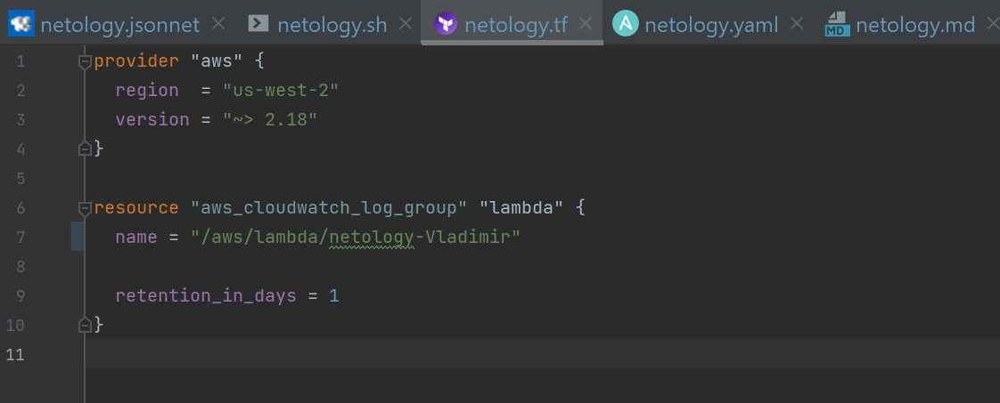
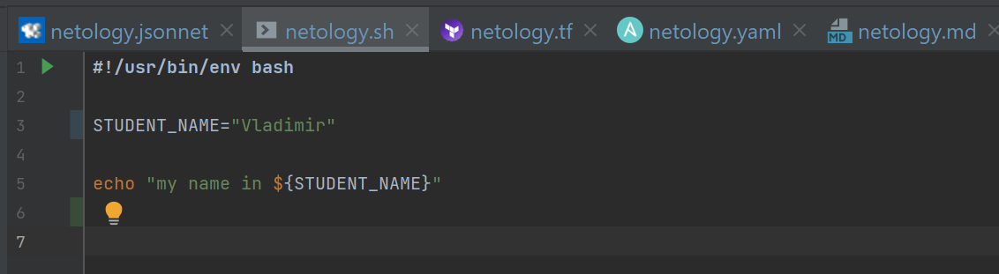
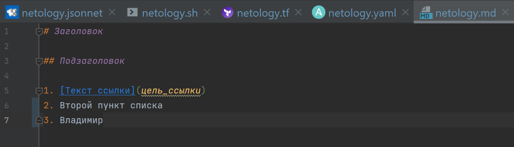
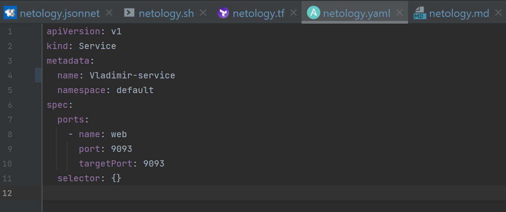
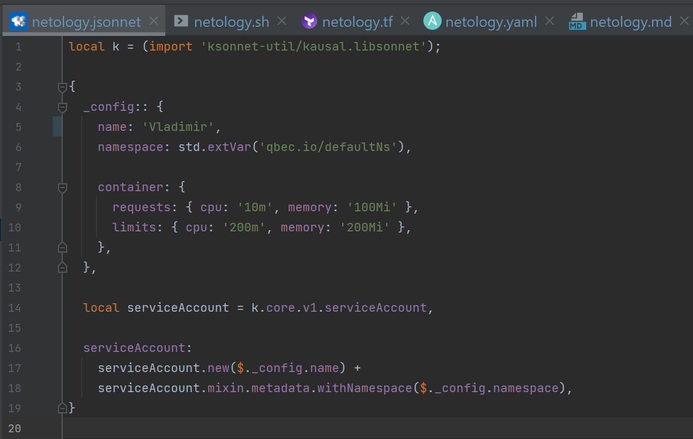

# Домашнее задание к занятию «1.1. Введение в DevOps»

## Задание №1 - Подготовка рабочей среды
Добавьте свое имя в каждый файл, сделайте снимок экрана и загрузите его на любой сервис обмена картинками.

## Решение №1
Картинки с именем в файлах и подсветкой синтаксиса
    - Terraform: 
    - Bash: 
    - Markdown: 
    - Yaml: 
    - Jsonnet: 

## Задание №2 - Описание жизненного цикла задачи (разработки нового функционала)
Вам необходимо описать процесс решения задачи в соответствии с жизненным циклом разработки программного обеспечения. Использование какого-либо конкретного метода разработки не обязательно. Для решения главное - прописать по пунктам шаги решения задачи (релизации в конечный результат) с участием менеджера, разработчика (или команды разработчиков), тестировщика (или команды тестировщиков) и себя как DevOps-инженера. 

## Решение №2
0. Менеджер получает требования от заказчика.
1. Менеджер/аналитик формулирует и декомпозирует задачи и устанавливает сроки.
2. Разработчики на общем собрании распределяют задачи (приоритеный блок задач), с учётом сроков.
3. Готовый код деплоится в тестовой среде. DevOps обеспечивает автоматизацию этого процесса и быстрое и подробное информирование разработчика в случае возникновения проблем с его кодом.
4. Тестировщики проверяют работу приложения. DevOps обеспечивает возможность быстро откатить версию или сравнить работу различных версий в одинаковых условиях.
5. После успешного тестирования работа готового функционала демонстрируется заказчику. При утверждении изменений версия деплоится в прод.
